# Лабораторная работа 1 (CV)


| ФИО                        | Группа      |
|----------------------------|-------------|
| Федоров Алексей Алексеевич | М8О-409Б-22 |

Что было сделано:
- Задание на 5 (Проведение исследований с моделями классификации)

## 1. Выбор начальных условий

### 1a) Датасет и обоснование выбора

Для работы выбран датасет **Garbage Classification v2** (10 классов мусора).  
Практическая задача: построить модель для автоматической сортировки отходов (умная урна, сортировочная линия, mobile-app для подсказок пользователю).

В эксперименте использована локальная версия `dataset/standardized_256`:

- число изображений: **12 259**
- число классов: **10**
- классы: `battery`, `biological`, `cardboard`, `clothes`, `glass`, `metal`, `paper`, `plastic`, `shoes`, `trash`

Распределение по классам (всего):

| Класс | Кол-во |
|---|---:|
| battery | 756 |
| biological | 699 |
| cardboard | 1411 |
| clothes | 1892 |
| glass | 1736 |
| metal | 930 |
| paper | 1336 |
| plastic | 1597 |
| shoes | 1449 |
| trash | 453 |

### 1b) Метрики качества и обоснование

Выбраны метрики:

- **Accuracy** — понятная итоговая доля верных предсказаний.
- **Macro F1** — ключевая метрика для сравнения моделей, т.к. классы несбалансированы (`trash` сильно меньше `clothes`/`glass`).
- **Weighted F1** — компромиссная F1 с учётом размеров классов.
- **Macro Precision** и **Macro Recall** — чтобы отдельно видеть «ложные срабатывания» и «пропуски» по редким классам.

Основная метрика выбора лучшего baseline: **Macro F1 на test**.

## 2. Создание baseline и оценка качества

### 2a) Обучение моделей из torchvision

Обучены две модели из `torchvision`:

- **CNN**: `resnet18`
- **Transformer**: `vit_b_16`

Базовые настройки:

- Transfer learning с ImageNet-весами.
- Замена классификационной головы на 10 классов.
- В baseline обучалась только голова (`backbone` заморожен).
- Split: stratified `train/val/test = 70/15/15`, `seed=42`.
- Размер входа: `224x224`.
- Аугментации train: `RandomResizedCrop`, `RandomHorizontalFlip`.
- Для val/test: `Resize + CenterCrop`.
- Оптимизатор: `AdamW`.
- Устройство: `mps` (Apple Silicon).

В отчёте есть две серии baseline:

- **короткая** (из предыдущего прогона): `resnet18 = 6`, `vit_b_16 = 4`;
- **основная** (актуальная): `resnet18 = 20`, `vit_b_16 = 20`.

Команда запуска baseline на 20 эпох:

```bash
./scripts/run_p2_20epochs.sh
```

### 2b) Оценка baseline по выбранным метрикам

Короткая серия (6/4 эпох, для быстрого старта):

| Модель | Accuracy | Macro F1 | Weighted F1 | Best epoch | Train time, sec |
|---|---:|---:|---:|---:|---:|
| vit_b_16 | 0.9021 | 0.8952 | 0.9020 | 4 | 378.9 |
| resnet18 | 0.8347 | 0.8186 | 0.8328 | 5 | 117.6 |

Основная серия (20/20 эпох):

| Модель | Accuracy | Macro F1 | Weighted F1 | Best epoch | Train time, sec |
|---|---:|---:|---:|---:|---:|
| vit_b_16 | 0.9315 | 0.9272 | 0.9315 | 15 | 1943.4 |
| resnet18 | 0.8700 | 0.8601 | 0.8695 | 18 | 376.3 |

Что изменилось при переходе к 20 эпохам:

| Модель | Δ Accuracy (20e - short) | Δ Macro F1 (20e - short) |
|---|---:|---:|
| vit_b_16 | +0.0294 | +0.0320 |
| resnet18 | +0.0353 | +0.0415 |

Итог baseline (20 эпох): `vit_b_16` остаётся лучше `resnet18` по качеству, но дольше обучается.

## Графики

Распределение классов по split:

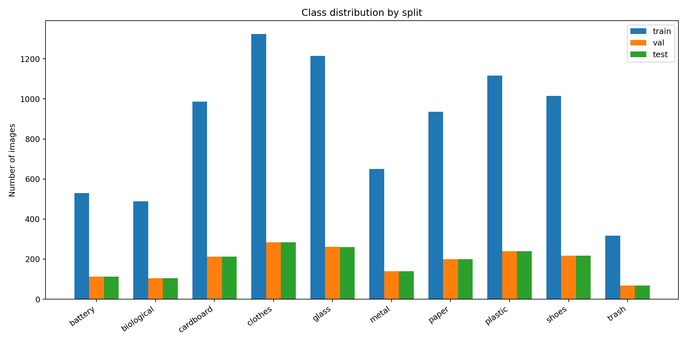

Learning curves baseline (20 эпох):

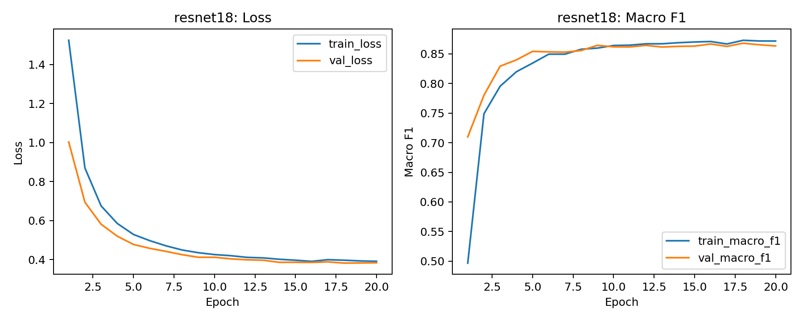

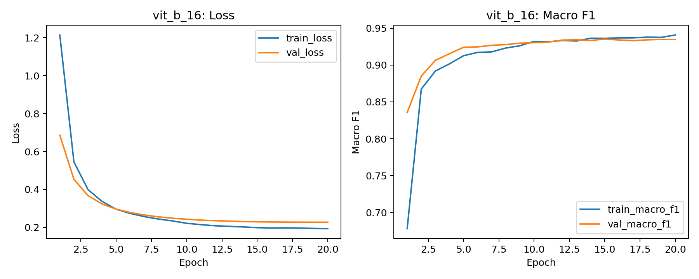

Confusion matrices baseline (20 эпох):

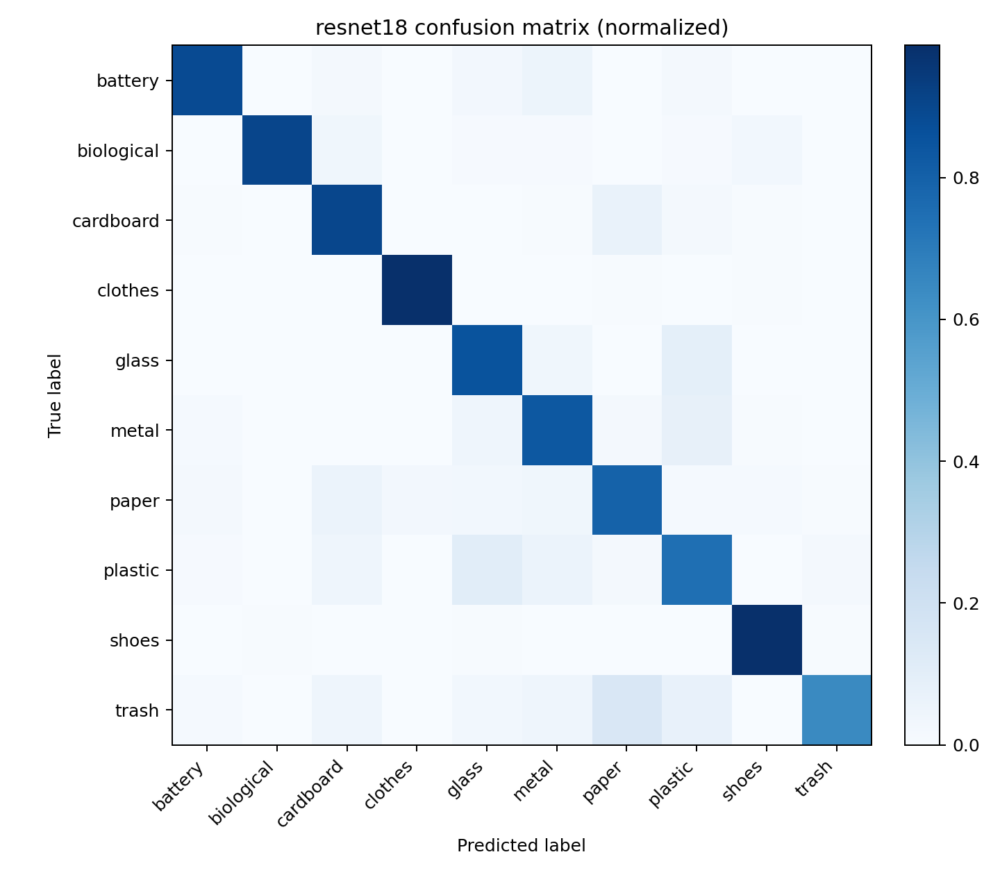


## 3. Улучшение baseline

### 3a) Гипотезы

Проверялись 4 сценария:

- **H0:** weak augmentation + замороженный backbone.
- **H1:** weak augmentation + full fine-tuning (разморозка backbone).
- **H2:** strong augmentation + full fine-tuning.
- **H3:** strong augmentation + full fine-tuning + weighted loss + label smoothing.

Критерий выбора: `best val Macro F1` на том же split, что и в baseline.

### 3b) Проверка гипотез

Сравнение короткой и основной серий для `resnet18`:

| Гипотеза | Best val Macro F1 (short, 3 эпохи) | Best val Macro F1 (20 эпох) | Δ (20e - short) | Test Macro F1 (20 эпох) |
|---|---:|---:|---:|---:|
| H0 | 0.8126 | 0.8697 | +0.0571 | 0.8659 |
| H1 | 0.9357 | **0.9534** | +0.0177 | **0.9412** |
| H2 | 0.9228 | 0.9494 | +0.0265 | 0.9244 |
| H3 | 0.9235 | 0.9495 | +0.0260 | 0.9292 |

Вывод по гипотезам не изменился: лучший вариант — **H1 (weak + unfreeze)**.

График проверки гипотез:

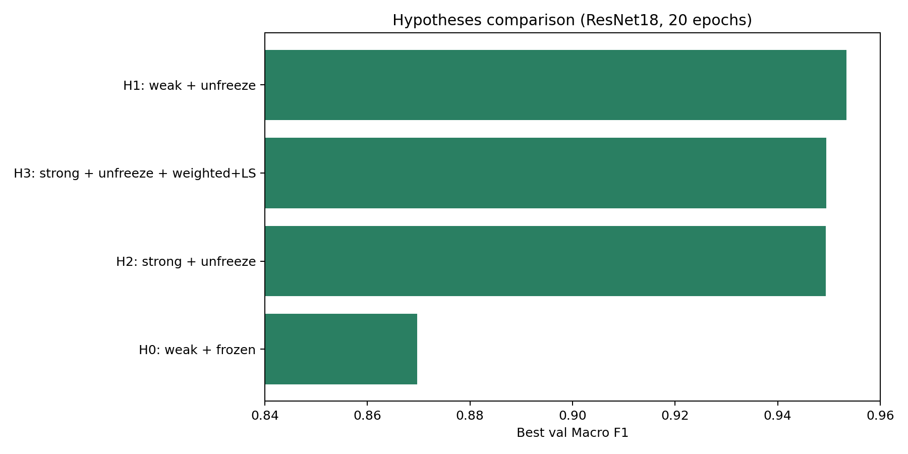

### 3c) Сформированный improved baseline

По результатам проверки выбран конфиг:

- `trainable_backbone=True` (full fine-tuning);
- weak augmentation (`RandomResizedCrop + HorizontalFlip`);
- `CrossEntropyLoss` без class weights и без label smoothing;
- `AdamW` + cosine scheduler;
- тот же split, что в пункте 2.

### 3d) Обучение моделей с improved baseline

Команда запуска improved baseline на 20 эпох:

```bash
./scripts/run_p3_20epochs.sh
```

### 3e) Оценка качества improved baseline

Короткая серия (из предыдущего прогона, 6/4 эпох):

| Модель | Accuracy | Macro F1 | Weighted F1 |
|---|---:|---:|---:|
| vit_b_16 | 0.9511 | 0.9437 | 0.9510 |
| resnet18 | 0.9358 | 0.9246 | 0.9354 |

Основная серия (20/20 эпох):

| Модель | Accuracy | Macro F1 | Weighted F1 | Best epoch | Train time, sec |
|---|---:|---:|---:|---:|---:|
| vit_b_16 | 0.9592 | 0.9532 | 0.9591 | 16 | 4850.0 |
| resnet18 | 0.9478 | 0.9412 | 0.9475 | 15 | 710.4 |

Прирост improved baseline при переходе к 20 эпохам:

| Модель | Δ Accuracy (20e - short) | Δ Macro F1 (20e - short) |
|---|---:|---:|
| vit_b_16 | +0.0082 | +0.0095 |
| resnet18 | +0.0120 | +0.0166 |

### 3f) Сравнение improved baseline с baseline

Сравнение в основной серии (20 эпох):

| Модель | Baseline Macro F1 | Improved Macro F1 | Δ Macro F1 | Baseline Accuracy | Improved Accuracy | Δ Accuracy |
|---|---:|---:|---:|---:|---:|---:|
| vit_b_16 | 0.9272 | 0.9532 | +0.0261 | 0.9315 | 0.9592 | +0.0277 |
| resnet18 | 0.8601 | 0.9412 | +0.0811 | 0.8700 | 0.9478 | +0.0778 |

Для контекста, в короткой серии улучшение было больше:

- `vit_b_16`: +0.0486 Macro F1 и +0.0489 Accuracy;
- `resnet18`: +0.1060 Macro F1 и +0.1011 Accuracy.

Это ожидаемо: baseline на 20 эпохах сам стал сильнее, поэтому разница с improved сократилась.

График сравнения baseline vs improved (20 эпох):

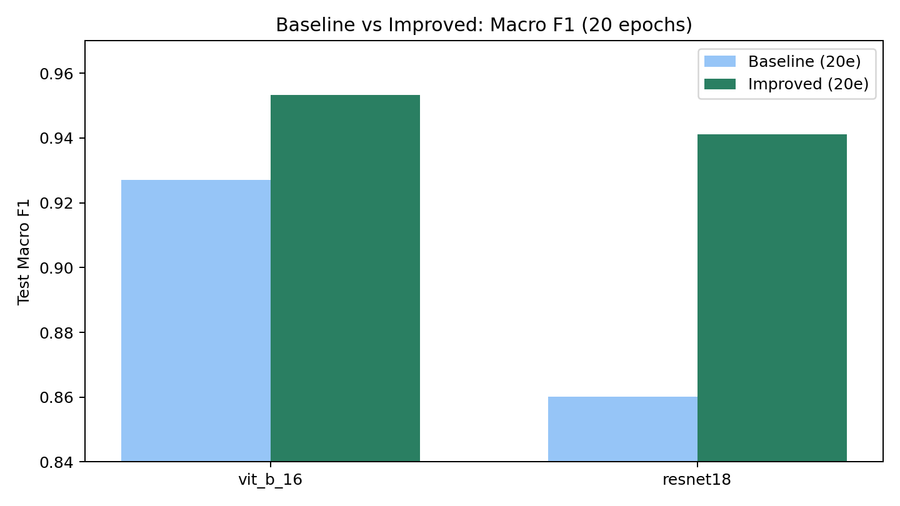

### 3g) Выводы

- Дополнительные эпохи улучшили и baseline, и improved baseline.
- Лучший конфиг из гипотез: **weak augmentation + full fine-tuning**.
- `vit_b_16` даёт максимум качества, но цена — самое долгое обучение.
- На 20 эпохах улучшенный baseline всё равно заметно лучше обычного baseline, особенно для `resnet18`.

## Графики improved baseline (20 эпох)

Learning curves:

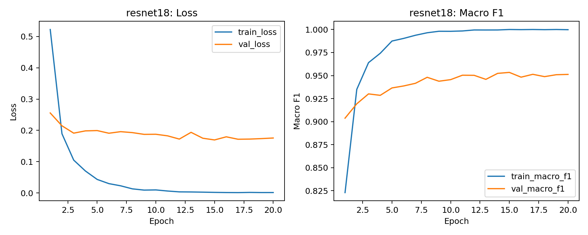

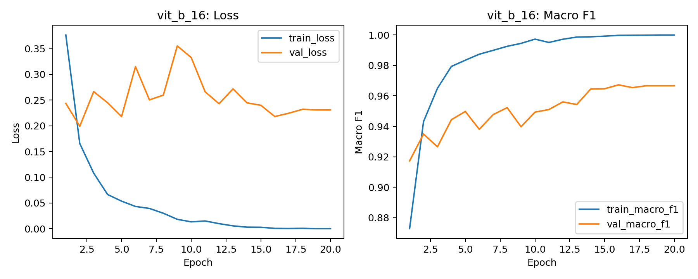

Confusion matrices:


### Дополнительные графики по гипотезам (20 эпох)

Learning curves `resnet18`:

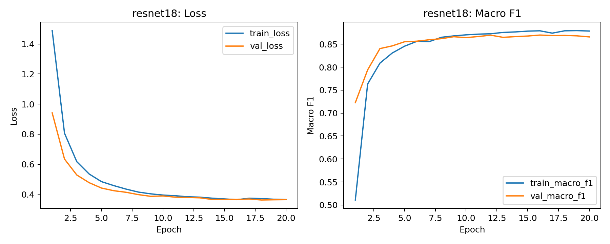


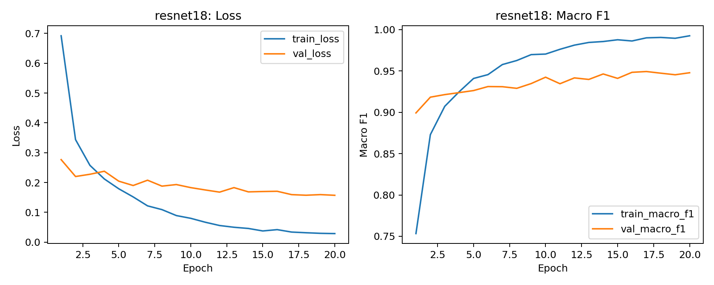

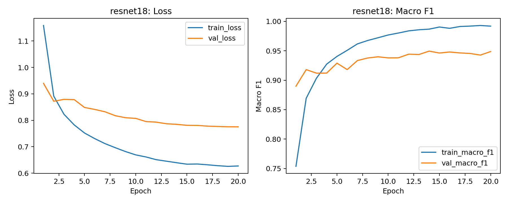

Confusion matrices `resnet18` для H0-H3:


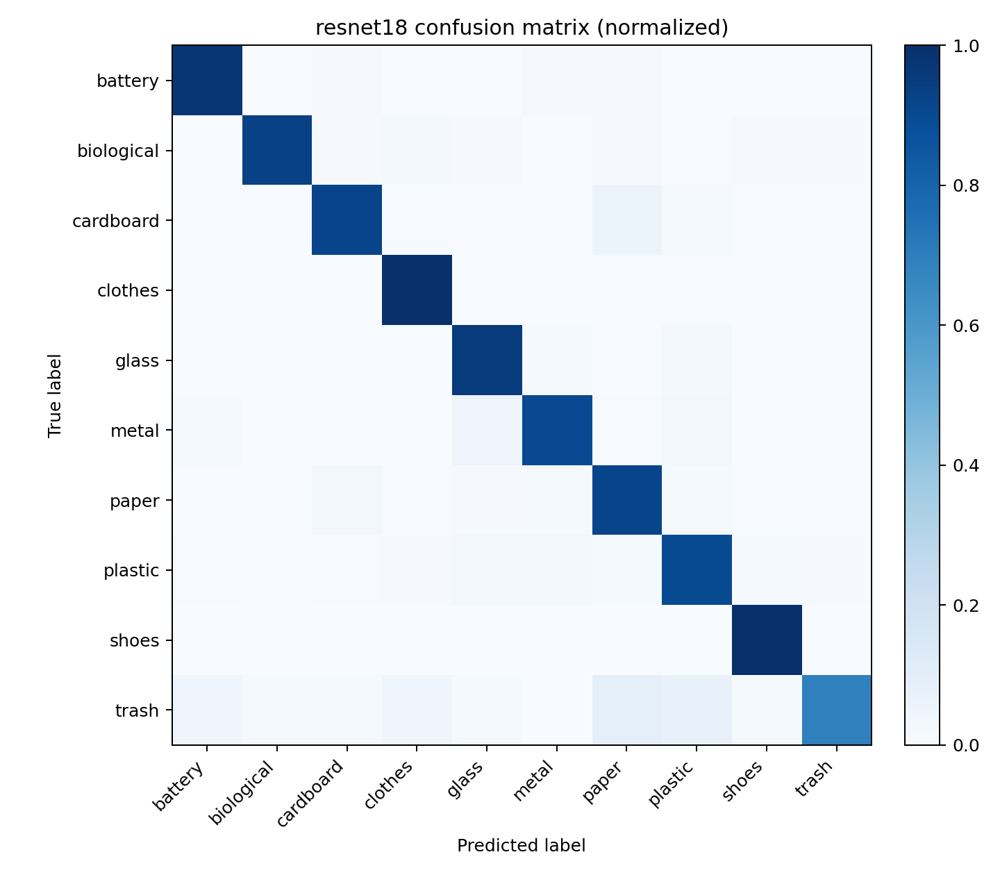


## 4. Имплементация алгоритма машинного обучения

### 4a) Самостоятельная имплементация моделей

В [custom_models_experiments.py](./src/custom_models_experiments.py) реализованы две модели без использования готовых архитектур из `torchvision`:

- `custom_cnn`: свёрточные блоки `Conv-BN-ReLU`, промежуточный pooling, `AdaptiveAvgPool2d(1)`, линейная классификационная голова.
- `tiny_vit`: собственный компактный ViT с conv stem, patch embedding, learnable `cls_token`, позиционными эмбеддингами, transformer-блоками (`MultiheadAttention + MLP`), stochastic depth (`DropPath`) и LayerScale.

### 4b) Обучение имплементированных моделей

Финальный запуск пункта 4 выполнен на 40 эпохах (отдельно для baseline и improved), на том же split из пункта 2:

- `split_csv = artifacts/baseline/splits.csv`
- `seed = 42`
- `device = mps`

Команда запуска:

```bash
./scripts/run_p4_40epochs.sh
```

### 4c) Оценка качества имплементированных моделей (4a-4e, baseline)

Результаты baseline-фазы (40 эпох):

| Модель | Params | Accuracy | Macro F1 | Weighted F1 | Best epoch | Train time, sec |
|---|---:|---:|---:|---:|---:|---:|
| custom_cnn | 1 175 786 | 0.7879 | 0.7806 | 0.7872 | 38 | 1652.5 |
| tiny_vit | 3 983 338 | 0.7091 | 0.6925 | 0.7067 | 28 | 2030.5 |

### 4d) Сравнение с результатами из пункта 2

Сравнение с baseline-моделями из пункта 2 (`resnet18` и `vit_b_16`, серия 20 эпох):

| Пара | Macro F1 (п.4 baseline) | Macro F1 (п.2 baseline) | Δ Macro F1 (п.4 - п.2) | Accuracy (п.4 baseline) | Accuracy (п.2 baseline) | Δ Accuracy (п.4 - п.2) |
|---|---:|---:|---:|---:|---:|---:|
| custom_cnn vs resnet18 | 0.7806 | 0.8601 | -0.0795 | 0.7879 | 0.8700 | -0.0821 |
| tiny_vit vs vit_b_16 | 0.6925 | 0.9272 | -0.2346 | 0.7091 | 0.9315 | -0.2224 |

### 4e) Выводы по 4a-4d

- Самописный `custom_cnn` получился рабочим и достаточно сильным: отставание от `resnet18` из пункта 2 составляет около 0.08 по Accuracy и Macro F1.
- Самописный `tiny_vit` заметно слабее `vit_b_16`; это ожидаемо для обучения с нуля на данном объёме данных.
- По времени обучения `tiny_vit` дороже `custom_cnn`, но качество при этом ниже.

### 4f) Добавление техник из improved baseline (п.3с)

Во второй фазе применены техники из улучшенного baseline:

- более агрессивные train-аугментации;
- `AdamW`, регуляризация и scheduler;
- gradient clipping;
- для ViT — увеличенная архитектура (`dim=256, depth=10, heads=8`) и более жёсткая регуляризация.

### 4g) Обучение моделей с техниками из 3с

В improved-фазе (40 эпох) переобучены обе самописные модели на том же split.

### 4h) Оценка качества моделей с техниками из 3с

Результаты improved-фазы:

| Модель | Params | Accuracy | Macro F1 | Weighted F1 | Best epoch | Train time, sec |
|---|---:|---:|---:|---:|---:|---:|
| custom_cnn (improved) | 1 175 786 | 0.7988 | 0.7784 | 0.7987 | 38 | 2115.7 |
| tiny_vit (improved) | 8 632 458 | 0.7036 | 0.6918 | 0.7038 | 36 | 3339.6 |

Сравнение внутри пункта 4 (`baseline → improved`):

| Модель | Macro F1 baseline | Macro F1 improved | Δ Macro F1 | Accuracy baseline | Accuracy improved | Δ Accuracy |
|---|---:|---:|---:|---:|---:|---:|
| custom_cnn | 0.7806 | 0.7784 | -0.0022 | 0.7879 | 0.7988 | +0.0109 |
| tiny_vit | 0.6925 | 0.6918 | -0.0007 | 0.7091 | 0.7036 | -0.0054 |

### 4i) Сравнение с пунктом 3

Сравнение с improved baseline из пункта 3 (`resnet18`, `vit_b_16`, серия 20 эпох):

| Пара | Macro F1 (п.4 improved) | Macro F1 (п.3 improved) | Δ Macro F1 (п.4 - п.3) | Accuracy (п.4 improved) | Accuracy (п.3 improved) | Δ Accuracy (п.4 - п.3) |
|---|---:|---:|---:|---:|---:|---:|
| custom_cnn vs resnet18 | 0.7784 | 0.9412 | -0.1628 | 0.7988 | 0.9478 | -0.1490 |
| tiny_vit vs vit_b_16 | 0.6918 | 0.9532 | -0.2614 | 0.7036 | 0.9592 | -0.2556 |

### 4j) Выводы по пункту 4

- Пункт 4 выполнен полностью: самописные модели реализованы, обучены, оценены и сопоставлены с пунктами 2 и 3.
- `custom_cnn` показывает практичный результат: по Accuracy приблизился к 0.80 и даёт небольшой выигрыш по Accuracy в improved-фазе.
- Для `custom_cnn` улучшенная фаза повысила Accuracy, но не Macro F1. Это означает, что модель стала лучше на частых классах, а качество по редким классам почти не выросло.
- Для `tiny_vit` переход к improved-фазе в текущей конфигурации не дал прироста. Даже с увеличением модели качество осталось примерно на уровне baseline-фазы, а время обучения выросло.
- Главное различие с пунктами 2 и 3 остаётся прежним: там использовались большие предобученные модели, здесь — обучение самописных архитектур с нуля.

## Графики пункта 4 (40 эпох)

Learning curves (baseline):

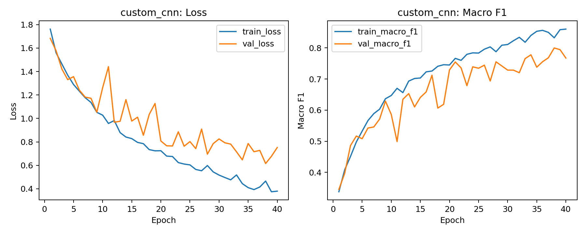

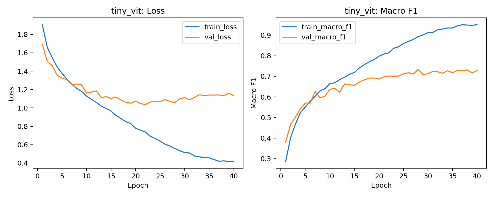

Learning curves (improved):

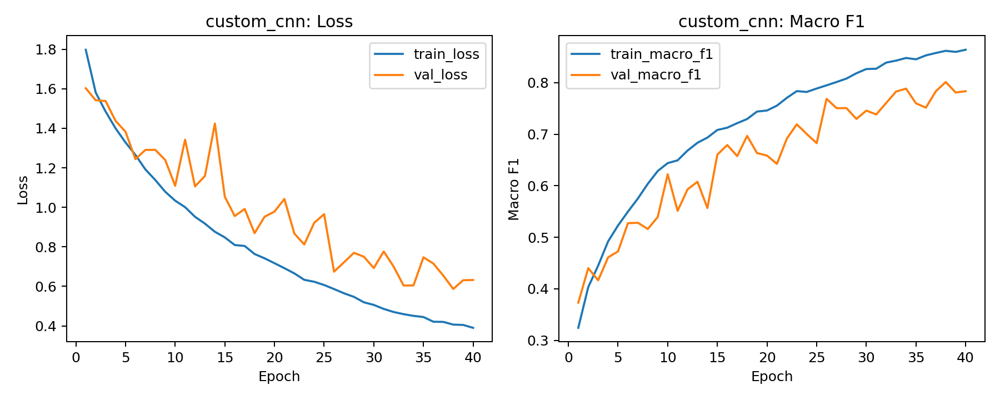

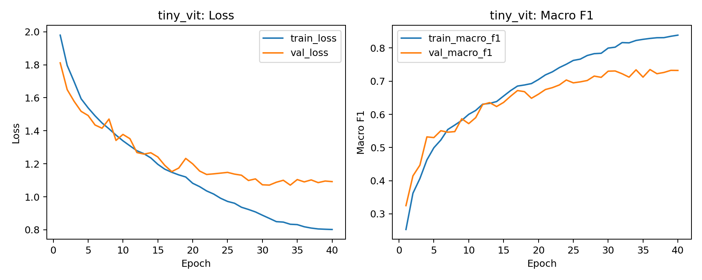

Confusion matrices (baseline):

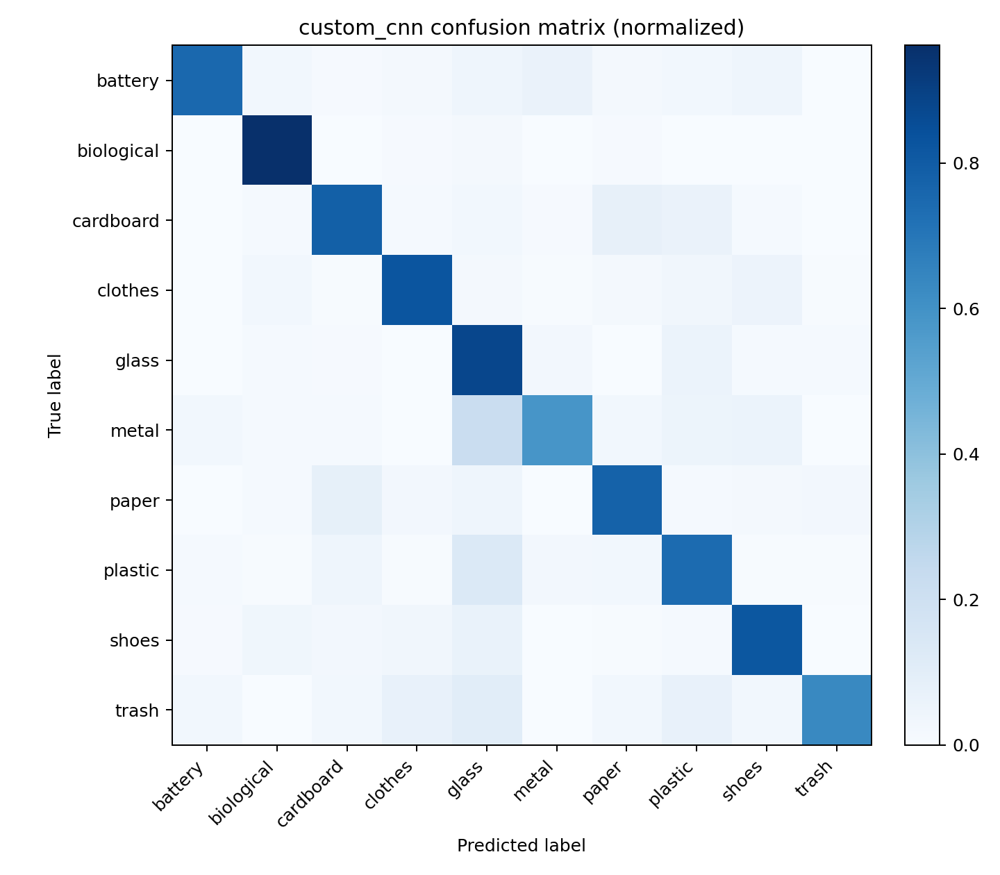

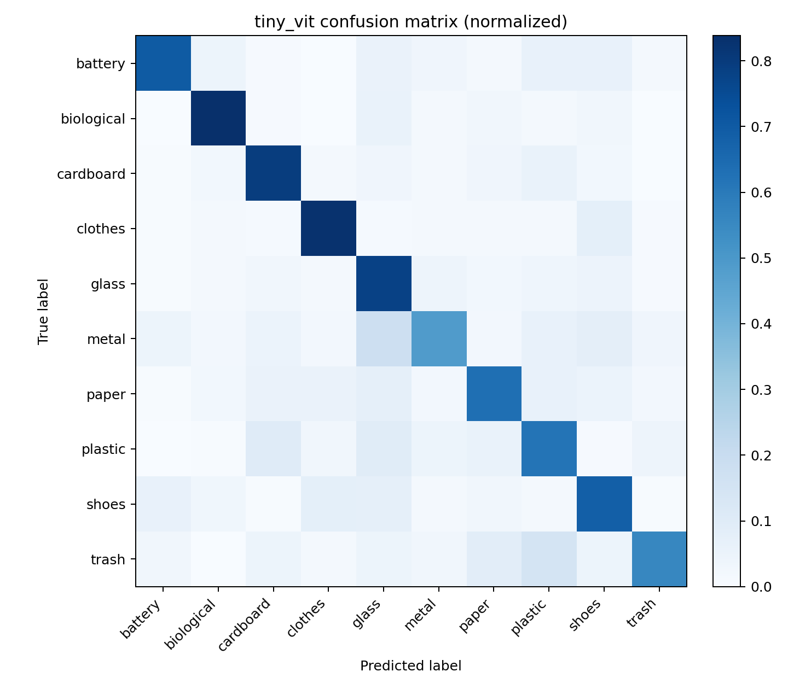

Confusion matrices (improved):

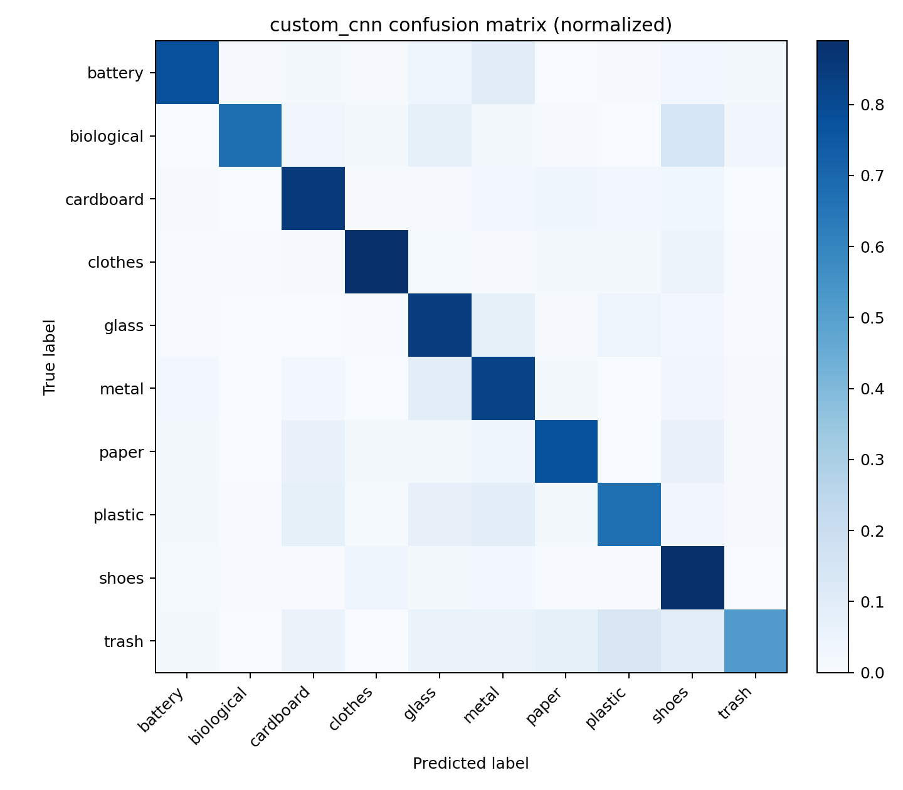

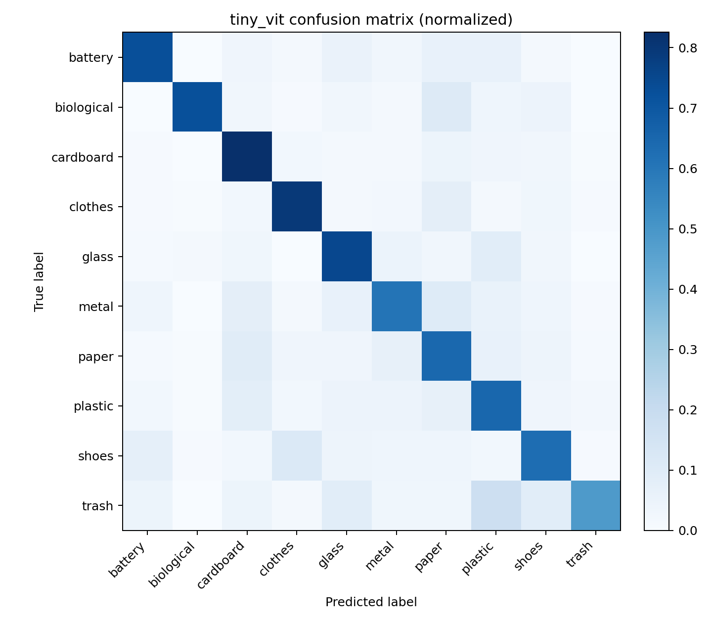
